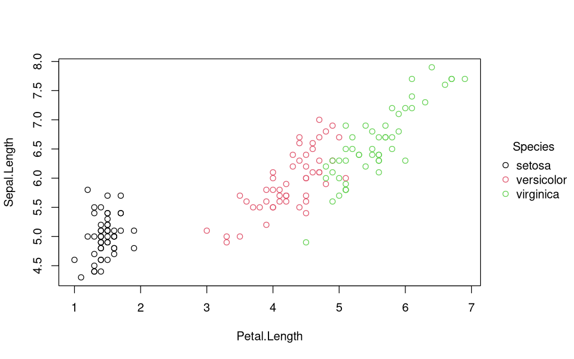
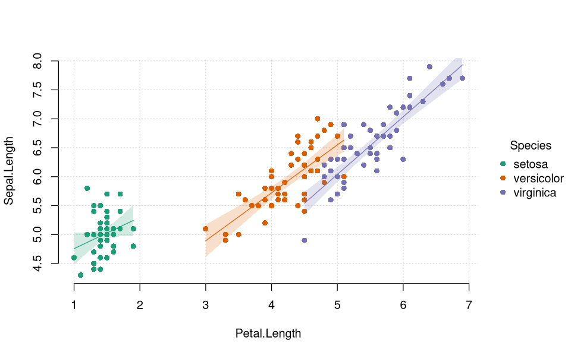
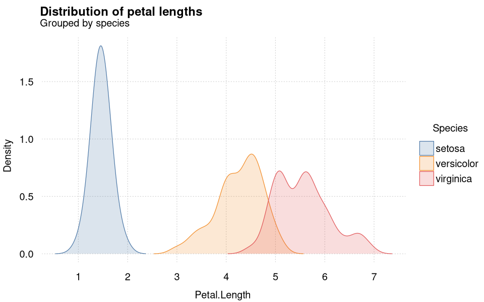
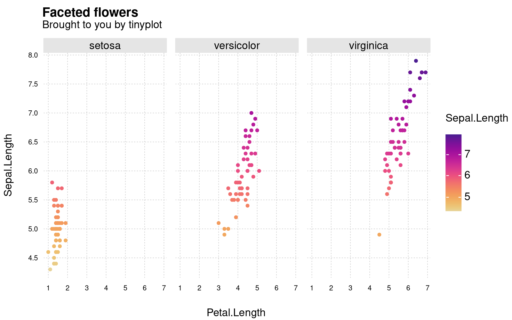

# tinyplot 

<!-- badges: start -->

<a href="https://CRAN.R-project.org/package=tinyplot"></a>
<a href="https://grantmcdermott.r-universe.dev"></a>
<a href="https://CRAN.R-project.org/package=tinyplot"></a>
<a href="https://github.com/grantmcdermott/tinyplot/actions/workflows/R-CMD-check.yaml"></a>
<a href = "https://github.com/grantmcdermott/tinyplot/blob/main/LICENSE.md" target = "_blank"></a>
<a href="https://grantmcdermott.com/tinyplot/index.html"></a>
<!-- badges: end -->

## What

A lightweight extension of the base R graphics system, with support for
automatic grouping, legends, facets, and various other enhancements.

The stable version of **tinyplot** is available on CRAN.

``` r
install.packages("tinyplot")
```

Or, you can grab the latest development version from R-universe.

``` r
install.packages("tinyplot", repos = "https://grantmcdermott.r-universe.dev")
```

## Why

R users are spoiled for choice when it comes to visualization
frameworks. The options, of course, include **lattice** and **ggplot2**;
say nothing of the bewildering array of extensions built around, on top
of, and in between these amazing packages.[^1]

Given the wealth of options, it is perhaps understandable that even avid
R users can overlook the base R **graphics** system. This is
unfortunate, because base R offers very powerful and flexible plotting
facilities.[^2] The downside of this power and flexibility is that base
R plotting can require a lot of manual tinkering. A case in point is
plotting grouped data with an appropriate legend. Doing so with the
generic `plot()` function can require several function calls or a loop,
fiddling with your plot regions, and then generating the legend
manually.

The **tinyplot** package aims to remove this overhead. It provides a
lightweight extension of the base R graphics system that preserves the
same core logic and syntax, but with numerous convenience features to
make base R plotting a more user-friendly experience. For example, the
core `tinyplot()` function—or its shorthand alias `plt()`—makes it easy
to plot grouped datasets and generate automatic legends in a single
function call. Or, you can display groups in separate facets without
having to worry about manually setting plot regions. While **tinyplot**
offers these and various other enhancements, it tries as far as possible
to be a drop-in replacement for the equivalent base plotting function.
Users should generally be able to swap out a valid `plot()` call for
`tinyplot()`/`plt()` without any changes to the expected output.

It is worth emphasizing that **tinyplot** requires *only* base R. It has
zero recursive dependencies and we have been careful to keep its
installation size down to a minimum. **tinyplot** should thus provide an
attractive and lightweight option for package developers (or regular R
users!) who would like to produce convenient and sophisticated plots,
combined with a minimal footprint.

## Quickstart

The **tinyplot** website includes a detailed [introductory
tutorial](https://grantmcdermott.com/tinyplot/vignettes/intro_tutorial.html),
with numerous examples. But here are some quickstart examples of the
package in action.

``` r
library(tinyplot)
```

Grouped scatterplot with automatic legend:

``` r
# with(iris, tinyplot(x = Petal.Length, y = Sepal.Length, by = Species)) # atomic
tinyplot(Sepal.Length ~ Petal.Length | Species, data = iris)             # formula
```



If you would prefer to save on a few keystrokes, you can use the
shorthand `plt()` alias instead instead of typing out `tinyplot()` in
full. Here’s the same plot with this shorthand alias, plus a few
aesthetic tweaks:

``` r
plt(
  Sepal.Length ~ Petal.Length | Species, 
  data = iris,
  palette = "dark", pch = 16,
  grid = TRUE, frame = FALSE
)
```



Grouped grouped density plot with automatic legend:

``` r
plt(
  ~ Petal.Length | Species,
  data = iris,
  type = "density",
  palette = "dark", fill = "by",
  grid = TRUE,
  main = "Distribution of petal lengths by species"
)
```



Grouped scatterplot with (continuous) gradient legend, combined with
facet layout:

``` r
plt(
  Sepal.Length ~ Petal.Length | Sepal.Length, data = iris,
  facet = ~Species, facet.args = list(bg = "grey90"),
  pch = 19,
  main = "Faceted Species!",
  grid = TRUE, frame = FALSE
)
```



Hopefully, these have been enough to pique your interest. Head over to
the [intro
tutorial](https://grantmcdermott.com/tinyplot/vignettes/intro_tutorial.html)
for many more examples, including range plots and customization.

[^1]: Both **lattice** and **ggplot2** are built on top of the **grid**
    package, which was incoporated into the base R distribution way back
    in R 2.0.0. **ggplot2**, in particular, is arguably the most
    important and influential (high-level) graphics library of the last
    two decades, across any programming language.

[^2]: Just type `demo(graphics)` or `demo(persp)` into your R console to
    get an idea. Or, take a look at
    [these](https://github.com/karoliskoncevicius/r_notes/blob/main/baseplotting.md)
    [two](https://quizzical-engelbart-d15a44.netlify.app/2021-2022_m2-data-2_visu-2_practice#1)
    excellent tutorials.
