<!-- README.md is generated from README.Rmd. Please edit that file -->

# plot2

<!-- badges: start -->

[](https://grantmcdermott.r-universe.dev)
[](https://github.com/grantmcdermott/plot2/actions/workflows/R-CMD-check.yaml)
<!-- badges: end -->

A lightweight extension of the base R `plot` function, with support for
automatic grouping and legend handling, and several other enhancements.

## Installation

**plot2** is not yet on CRAN, but can be installed from R-universe.

``` r
install.packages("plot2", repos = "https://grantmcdermott.r-universe.dev")
```

Our goal is to submit to CRAN by the end of July/August 2023, once we
have settled on some remaining design choices and features support. You
can take a look at the [open
issues](https://github.com/grantmcdermott/plot2/issues) to see what’s
currently under consideration. Please feel free to weigh on these if you
have opinions. We want end users to have a say in determining the final
product.

## Motivation

R users are spoiled for choice when it comes to visualization
frameworks. The options of course include **ggplot2** (arguably the most
important graphics system of the last decade) and **lattice**, not to
mention a bewildering array of extensions built around, on top of, and
in between these amazing packages.

It is perhaps not surprising, then, that the base R graphics system
sometimes gets short shrift. This is unfortunate, because base R offers
very powerful and flexible plotting facilities. Just type
`demo(graphics)` or `demo(persp)` into your R console to get an idea.
Or, take a look at
[these](https://github.com/karoliskoncevicius/tutorial_r_introduction/blob/main/baseplotting.md)
[two](https://quizzical-engelbart-d15a44.netlify.app/2021-2022_m2-data-2_visu-2_practice#1)
excellent tutorials. The downside of this power and flexibility is that
base R plotting can require a fair bit of manual tinkering. A case in
point is plotting grouped data with an appropriate legend. Doing so with
the generic `plot()` function can require several function calls or a
loop, fiddling with your plot regions, and then generating the legend
manually.

The **plot2** package aims to remove this overhead. It provides a
lightweight extension of the base R plot system with various convenience
features, particularly for creating (2D) scatter and line plots using
grouped data. For example, the core `plot2()` function makes it easy to
plot different categories of a dataset in a single function call and
highlight these categories (groups) using modern colour palettes.
Coincident with this grouping support, `plot2()` also produces automatic
legends with scope for further customization. While the package offers
several other enhancements, it tries as far as possible to be a drop-in
replacement for the equivalent base plot function. Users should
(generally) be able to swap a valid `plot()` call with `plot2()` without
any changes to the expected output.

## Examples

Let’s load the package then walk through some examples.

``` r
library(plot2)
```

### Similarity to `plot()`

As far as possible, `plot2` tries to be a drop-in replacement for
regular `plot` calls.

``` r
par(mfrow = c(1, 2))

plot(0:10, main = "plot")
plot2(0:10, main = "plot2")
```


Similarly, we can plot elements from a data frame using either the
atomic or formula methods.

``` r
par(mfrow = c(2, 2))

plot(airquality$Day, airquality$Temp, main = "plot")
plot(Temp ~ Day, data = airquality, main = "plot (formula)")
plot2(airquality$Day, airquality$Temp, main = "plot2")
plot2(Temp ~ Day, data = airquality, main = "plot2 (formula)")
```

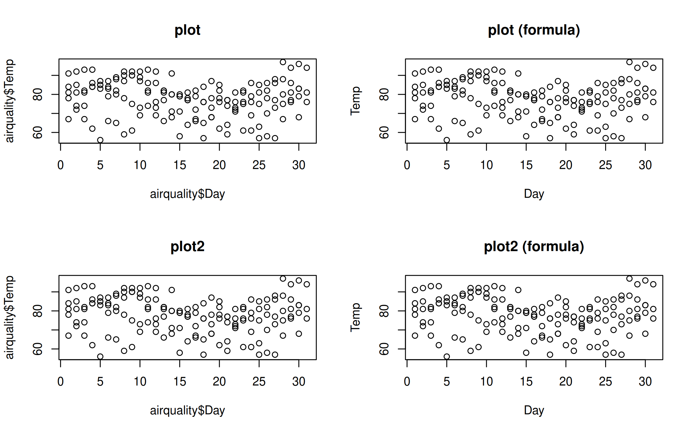

``` r

dev.off() # reset to default (single) plot window
#> null device 
#>           1
```

### Grouped data

So far, so good. But where `plot2` starts to diverge from its base
counterpart is with respect to grouped data. In particular, `plot2`
allows you to characterize groups using the `by` argument.[^1]

``` r
# plot2(airquality$Day, airquality$Temp, by = airquality$Month) # same as below
with(airquality, plot2(Day, Temp, by = Month))
```

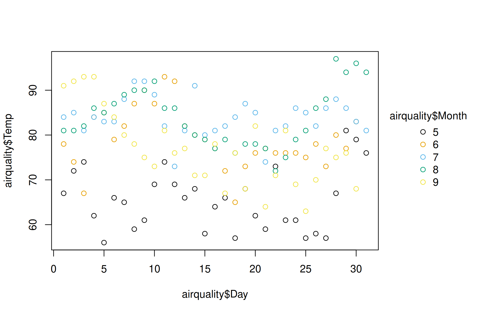

An even more convenient approach is to use the equivalent formula
syntax. Just place the grouping variable after a vertical bar (i.e.,
`|`).

``` r
plot2(Temp ~ Day | Month, data = airquality)
```

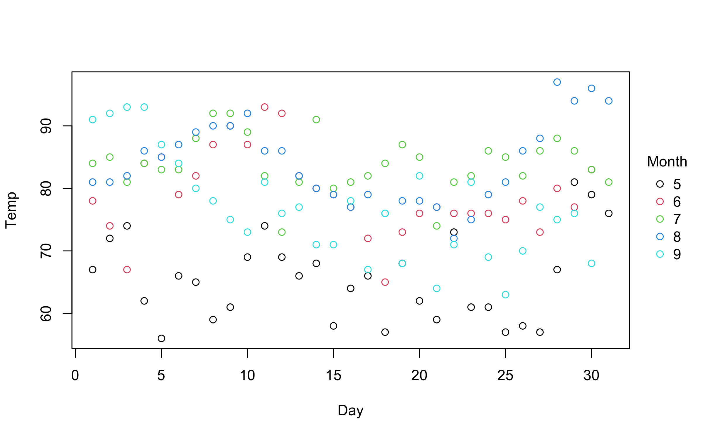

You can use standard base plotting arguments to adjust features of your
plot. For example, change `pch` (plot character) to get filled points.

``` r
plot2(
  Temp ~ Day | Month,
  data = airquality,
  pch = 16
)
```

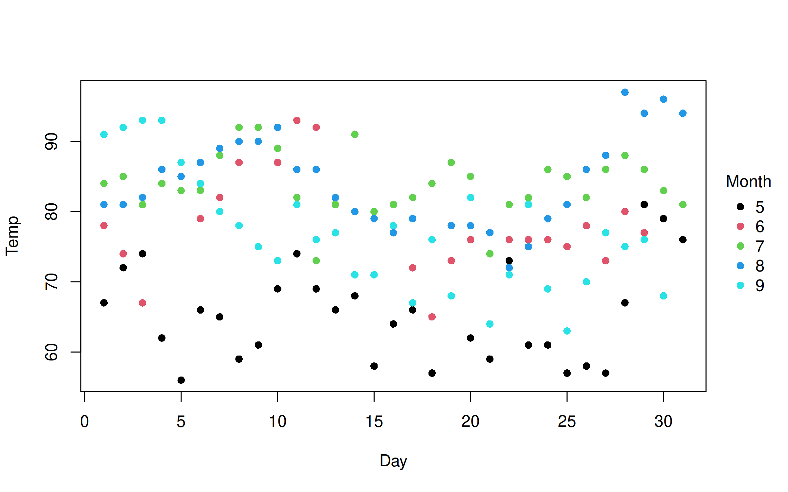

Similarly, converting to a grouped line plot is a simple matter of
adjusting the `type` argument.

``` r
plot2(
  Temp ~ Day | Month,
  data = airquality,
  type = "l"
)
```

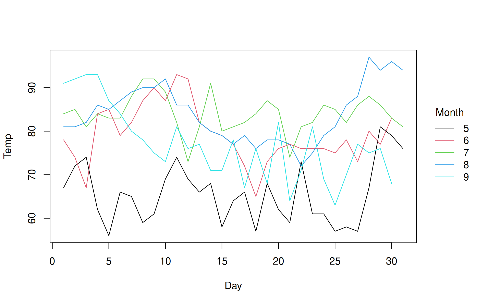

Note that we can automatically adjust both `pch` and `lty` by groups
using the `"by"` convenience keyword. This can be used in conjunction
with the default group colouring. Or, as a replacement for group
colouring—an option that may be particularly useful for contexts where
colour is expensive or prohibited (e.g., certain academic journals).

``` r
plot2(
  Temp ~ Day | Month,
  data = airquality,
  type = "l",
  col = "black", # override automatic group colours
  lty = "by"     # change line type by group instead
)
```

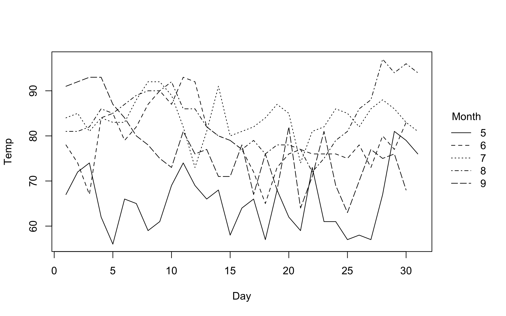

### Colors

On the subject of group colours, these are easily customized via the
`palette` argument. The default group colours are inherited from either
the “R4” or “Viridis” palettes, depending on the number of groups.
However, all of the many palettes listed by `palette.pals()` and
`hcl.pals()` are supported as convenience strings.[^2] For example:

``` r
plot2(
  Temp ~ Day | Month,
  data = airquality,
  type = "l",
  palette = "Tableau 10" # or "ggplot2", "Okabe-Ito", "Set 2", "Harmonic", etc.
)
```

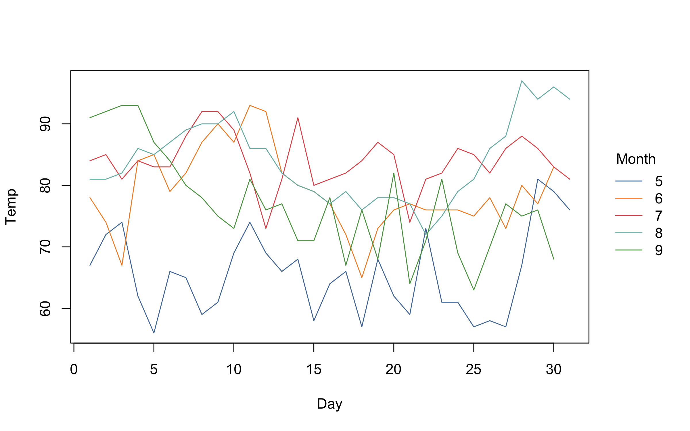

Beyond these convenience strings, users can also supply a valid
palette-generating function for finer control over transparency, colour
order, and so forth. We’ll see a demonstration of this further below.

### Legend

In all of the preceding plots, you will have noticed that we get an
automatic legend. The legend position and look can be customized using
appropriate arguments. You can change (or turn off) the legend title and
bounding box, switch the direction of the legend text, etc. Below, we
particularly draw your attention to the trailing “!” in the `legend`
position argument. This tells `plot2` to place the legend *outside* the
plot area.

``` r
plot2(
  Temp ~ Day | Month,
  data = airquality,
  type = "l",
  legend = legend("bottom!", title = "Month of the year", bty = "o")
)
```

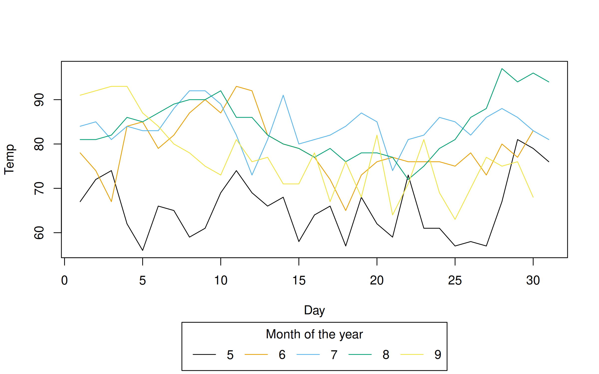

Note that legend position keywords without the exclamation point (i.e.,
for inside the plot area) should still as per normal. Grouped density
plot example:

``` r
with(airquality, plot2(
  density(Temp),
  by = Month,
  legend = legend("topright", bty = "o")
))
```

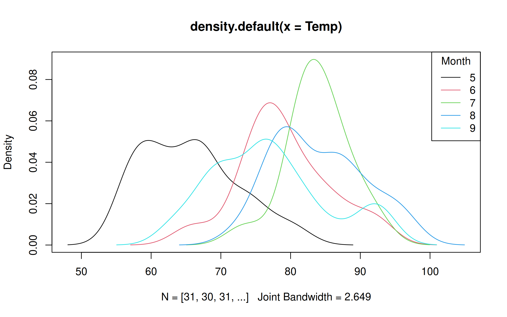

### Point range and error bar plots

`plot2` adds supports for point range and error bar plots via the
`"pointrange"` and `"errorbar"` type arguments. An obvious use-case is
for regression coefficient plots.

``` r
mod = lm(Temp ~ 0 + factor(Month), airquality)
coefs = data.frame(names(coef(mod)), coef(mod), confint(mod))
coefs = setNames(coefs, c("term", "estimate", "ci_low", "ci_high"))

with(
  coefs,
  plot2(
    x = term, y = estimate,
    ymin = ci_low, ymax = ci_high,
    type = "pointrange",
    pch = 19,
    main = "Effect on Temperature"
  )
)
```

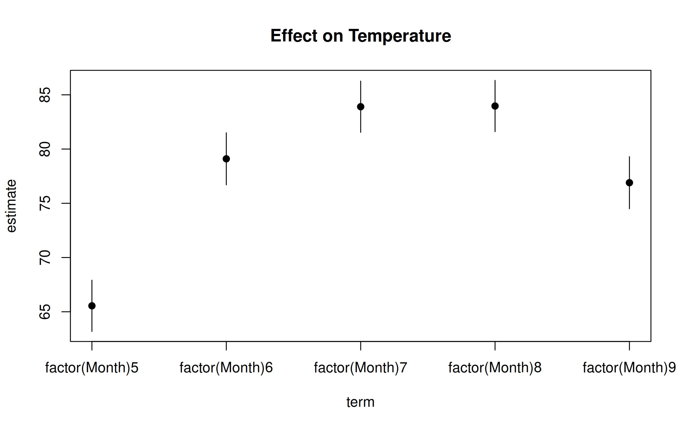

### Customization

Customizing your plots further is straightforward, whether that is done
by changing global parameters or invoking `plot2` arguments. Here’s a
quick penultimate example, where we change our point character and font
family globally, add some transparency to our colour palette, and use
Tufte-style floating axes with a background panel grid.

``` r
par(
  pch    = 16,           # Filled points as default 
  family = "HersheySans" # Use a (built-in) Hershey font instead of Arial default
)

plot2(
  Temp ~ Day | Month,
  data = airquality,
  type = "b",
  palette = palette.colors(palette = "Tableau 10", alpha = 0.5),
  main = "Daily temperatures by month",
  frame.plot = FALSE, grid = grid()
)
```

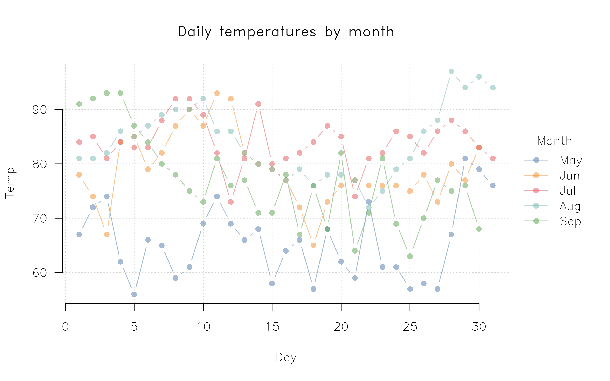

The use of `par` in the above example again underscores the
correspondence with the base graphics system. Because `plot2` is
effectively a convenience wrapper around base `plot`, any global
elements that you have set for the latter should carry over to the
former. For nice out-of-the-box themes, we recommend the **basetheme**
package.

``` r
par(family = "", pch = 15) # revert/change global changes from above

library(basetheme)
basetheme("royal") # or "clean", "dark", "ink", "brutal", etc.

plot2(
  Temp ~ Day | Month,
  data = airquality,
  type = "b",
  pch = "by",
  palette = "Tropic",
  main = "Daily temperatures by month"
)
```

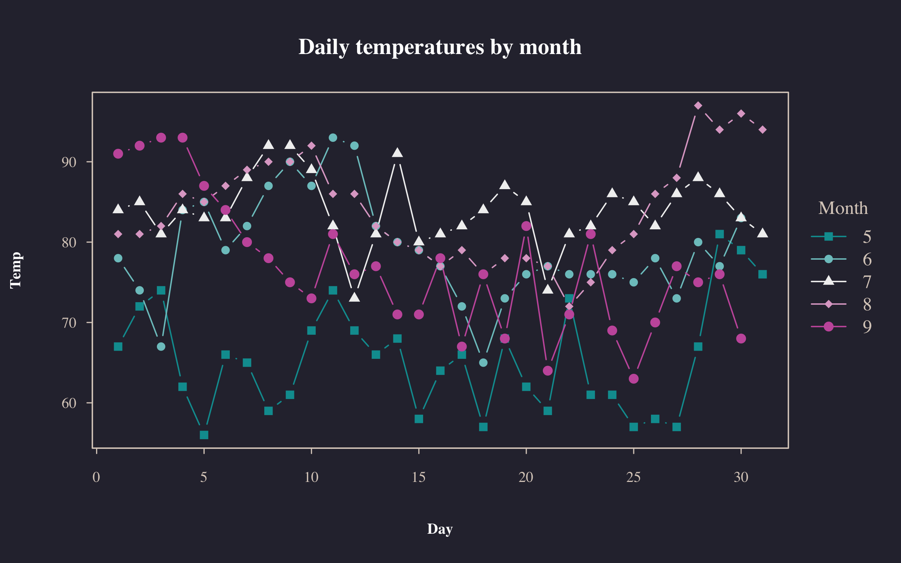

``` r

basetheme(NULL)  # back to default theme
dev.off()
#> null device 
#>           1
```

## Conclusion

In summary, consider the **plot2** package if you are looking for base R
`plot` functionality with some added convenience features. You can use
pretty much the same syntax and all of your theming elements should
carry over too. It has no dependencies other than base R itself and this
makes it an attractive option for situations where dependency management
is expensive (e.g., an R application running in a browser via
[WebAssembly](https://docs.r-wasm.org/webr/latest/)).

[^1]: At this point, experienced base plot users might protest that you
    *can* colour by groups using the `col` argument, e.g.
    `with(airquality, plot(Day, Temp, col = Month))`. This is true, but
    there are several limitations. First, you don’t get an automatic
    legend. Second, the base `plot.formula` method doesn’t specify the
    grouping within the formula itself (not a deal-breaker, but not
    particularly consistent either). Third, and perhaps most
    importantly, this grouping doesn’t carry over to line plots (i.e.,
    type=“l”). Instead, you have to transpose your data and use
    `matplot`. See
    [this](https://stackoverflow.com/questions/10519873/how-to-create-a-line-plot-with-groups-in-base-r-without-loops)
    old StackOverflow thread for a longer discussion.

[^2]: See the accompanying help pages of those two functions for more
    details on the available palettes, or read the
    [article](https://arxiv.org/pdf/2303.04918.pdf) by Achim Zeileis and
    Paul Murrell.
