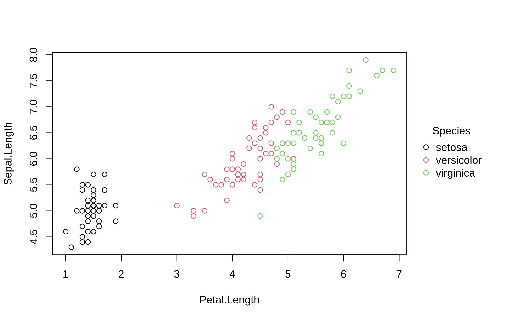
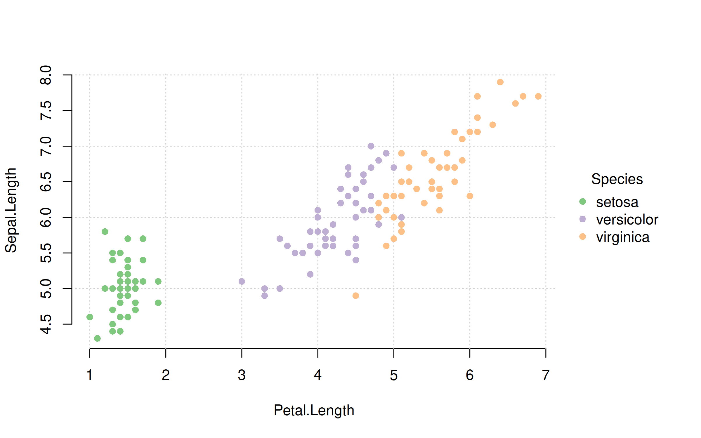
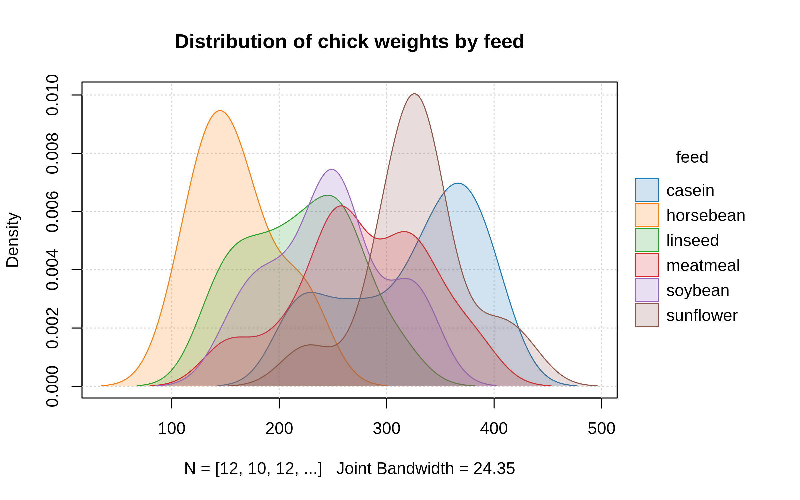
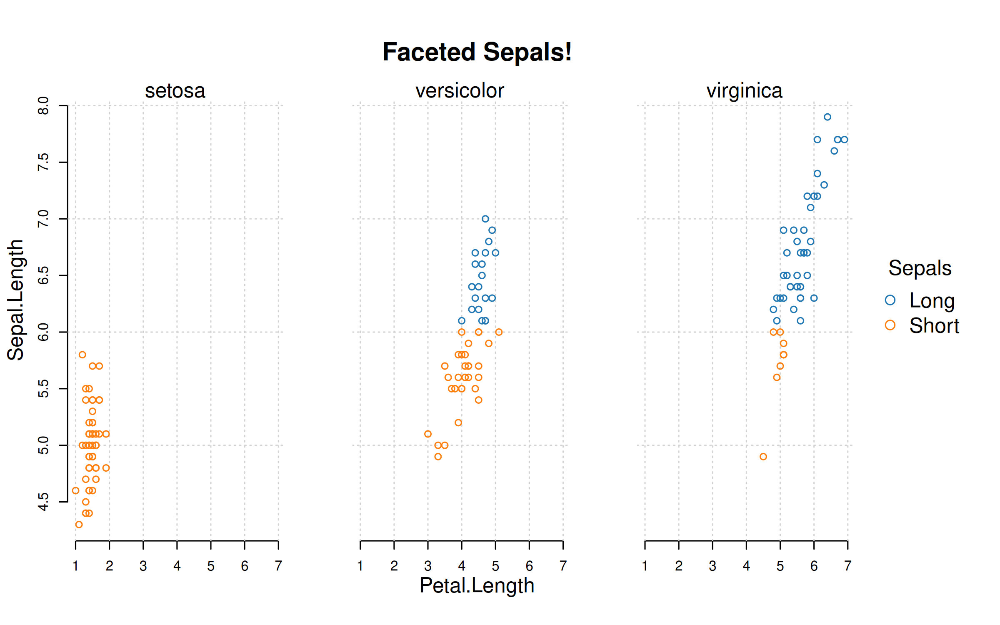

<!-- README.md is generated from README.Rmd. Please edit that file -->

# plot2

<!-- badges: start -->

[](https://grantmcdermott.r-universe.dev)
[](https://github.com/grantmcdermott/plot2/actions/workflows/R-CMD-check.yaml)
[](https://grantmcdermott.com/plot2/index.html)
<!-- badges: end -->

A lightweight extension of the base R `plot` system, with support for
automatic grouping and legend handling, and various other enhancements.

## Installation

**plot2** is not yet on CRAN, but can be installed from R-universe.

``` r
install.packages("plot2", repos = "https://grantmcdermott.r-universe.dev")
```

Our goal is to submit to CRAN towards the end of 2023, once we have
settled on some remaining design choices and features support. You can
take a look at the [open
issues](https://github.com/grantmcdermott/plot2/issues) to see what’s
currently under consideration. Please feel free to weigh on these if you
have opinions. We want end users to have a say in determining the final
product.

## Motivation

R users are spoiled for choice when it comes to visualization
frameworks. The options of course include **ggplot2** (arguably the most
important graphics system of the last decade) and **lattice**, not to
mention a bewildering array of extensions built around, on top of, and
in between these amazing packages.

It is perhaps not surprising, then, that the base R graphics system
sometimes gets short shrift. This is unfortunate, because base R offers
very powerful and flexible plotting facilities. Just type
`demo(graphics)` or `demo(persp)` into your R console to get an idea.
Or, take a look at
[these](https://github.com/karoliskoncevicius/tutorial_r_introduction/blob/main/baseplotting.md)
[two](https://quizzical-engelbart-d15a44.netlify.app/2021-2022_m2-data-2_visu-2_practice#1)
excellent tutorials. The downside of this power and flexibility is that
base R plotting can require a fair bit of manual tinkering. A case in
point is plotting grouped data with an appropriate legend. Doing so with
the generic `plot()` function can require several function calls or a
loop, fiddling with your plot regions, and then generating the legend
manually.

The **plot2** package aims to remove this overhead. It provides a
lightweight extension of the base R plot system with various convenience
features, particularly for creating (2D) scatter and line plots using
grouped data. For example, the core `plot2()` function makes it easy to
plot different categories of a dataset in a single function call and
highlight these categories (groups) using modern colour palettes.
Coincident with this grouping support, `plot2()` also produces automatic
legends with scope for further customization. While the package offers
several other enhancements, it tries as far as possible to be a drop-in
replacement for the equivalent base plot function. Users should
generally be able to swap a valid `plot()` call with `plot2()` without
any changes to the expected output.

## Examples

We provide a “[Get
Started](https://grantmcdermott.com/plot2/index.html#/vignettes/get_started)”
tutorial with numerous examples on the package homepage. But here are
some quickstart examples of the package in action.

``` r
library(plot2)

# Grouped scatterplot with automatic legend
plot2(
  Sepal.Length ~ Petal.Length | Species,
  data = iris
)
```



``` r
 
# Same plot with a few extra aesthetic tweaks
plot2(
  Sepal.Length ~ Petal.Length | Species, 
  data = iris,
  palette = "accent", pch  = 16,
  grid = TRUE, frame = FALSE
)
```



``` r

# Grouped density plot with automatic legend (and some aesthetic tweaks)
plot2(
  ~ weight | feed,
  data = chickwts,
  type = "density",
  main = "Distribution of chick weights by feed",
  palette = "classic", fill = "by",
  grid = TRUE
)
```



``` r

# Facet plots are supported too (combined with "by" grouping, or on their own)
with(
  Orange, 
  plot2(
    x = age, y = circumference, 
    facet = Tree, 
    type = "area",
    main = "Growth rates of five different orange trees",
    grid = TRUE, frame = FALSE
    )
)
```


