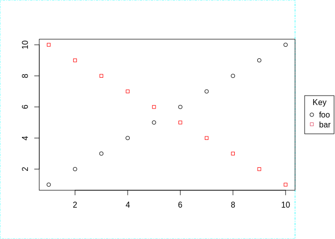
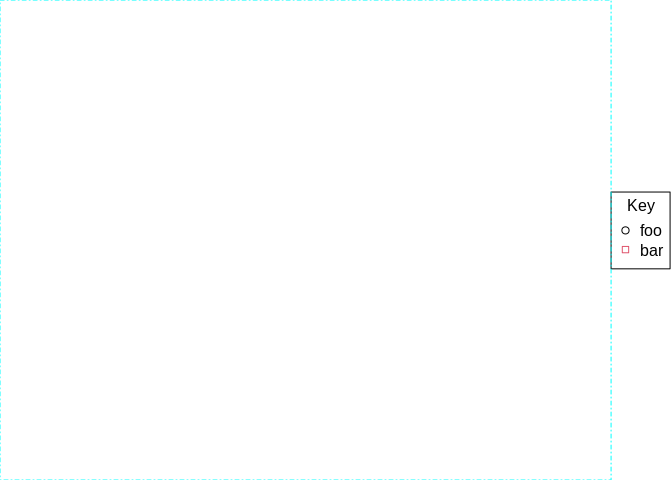

# Calculate placement of legend and and draw it

[**Source code**](https://github.com/grantmcdermott/plot2/tree/main/R/#L)

## Description

Internal function used to calculate the placement of (including outside
the plotting area) and drawing of legend.

## Usage

<pre><code class='language-R'>draw_legend(
  legend = NULL,
  legend.args = NULL,
  by_dep = NULL,
  lgnd_labs = NULL,
  type = NULL,
  pch = NULL,
  lty = NULL,
  col = NULL,
  bg = NULL,
  cex = NULL,
  lmar = NULL,
  has_sub = FALSE,
  new_plot = TRUE
)
</code></pre>

## Arguments

<table>
<tr>
<td style="white-space: nowrap; font-family: monospace; vertical-align: top">
<code id="draw_legend_:_legend">legend</code>
</td>
<td>
Legend placement keyword or list, passed down from <code>plot2</code>.
</td>
</tr>
<tr>
<td style="white-space: nowrap; font-family: monospace; vertical-align: top">
<code id="draw_legend_:_legend.args">legend.args</code>
</td>
<td>
Additional legend arguments to be passed to <code>legend()</code>.
</td>
</tr>
<tr>
<td style="white-space: nowrap; font-family: monospace; vertical-align: top">
<code id="draw_legend_:_by_dep">by_dep</code>
</td>
<td>
The (deparsed) "by" grouping variable name.
</td>
</tr>
<tr>
<td style="white-space: nowrap; font-family: monospace; vertical-align: top">
<code id="draw_legend_:_lgnd_labs">lgnd_labs</code>
</td>
<td>
The labels passed to <code>legend(legend = …)</code>.
</td>
</tr>
<tr>
<td style="white-space: nowrap; font-family: monospace; vertical-align: top">
<code id="draw_legend_:_type">type</code>
</td>
<td>
Plotting type(s), passed down from <code>plot2</code>.
</td>
</tr>
<tr>
<td style="white-space: nowrap; font-family: monospace; vertical-align: top">
<code id="draw_legend_:_pch">pch</code>
</td>
<td>
Plotting character(s), passed down from <code>plot2</code>.
</td>
</tr>
<tr>
<td style="white-space: nowrap; font-family: monospace; vertical-align: top">
<code id="draw_legend_:_lty">lty</code>
</td>
<td>
Plotting linetype(s), passed down from <code>plot2</code>.
</td>
</tr>
<tr>
<td style="white-space: nowrap; font-family: monospace; vertical-align: top">
<code id="draw_legend_:_col">col</code>
</td>
<td>
Plotting colour(s), passed down from <code>plot2</code>.
</td>
</tr>
<tr>
<td style="white-space: nowrap; font-family: monospace; vertical-align: top">
<code id="draw_legend_:_bg">bg</code>
</td>
<td>
Plotting character background fill colour(s), passed down from
<code>plot2</code>.
</td>
</tr>
<tr>
<td style="white-space: nowrap; font-family: monospace; vertical-align: top">
<code id="draw_legend_:_cex">cex</code>
</td>
<td>
Plotting character expansion(s), passed down from <code>plot2</code>.
</td>
</tr>
<tr>
<td style="white-space: nowrap; font-family: monospace; vertical-align: top">
<code id="draw_legend_:_lmar">lmar</code>
</td>
<td>
Legend margins (in lines). Should be a numeric vector of the form
<code>c(inner, outer)</code>, where the first number represents the
"inner" margin between the legend and the plot, and the second number
represents the "outer" margin between the legend and edge of the
graphics device. If no explicit value is provided by the user, then
reverts back to <code>par2(“lmar”)</code> for which the default values
are <code>c(1.0, 0.1)</code>.
</td>
</tr>
<tr>
<td style="white-space: nowrap; font-family: monospace; vertical-align: top">
<code id="draw_legend_:_has_sub">has_sub</code>
</td>
<td>
Logical. Does the plot have a sub-caption. Only used if keyword position
is "bottom!", in which case we need to bump the legend margin a bit
further.
</td>
</tr>
<tr>
<td style="white-space: nowrap; font-family: monospace; vertical-align: top">
<code id="draw_legend_:_new_plot">new_plot</code>
</td>
<td>
Should we be calling plot.new internally?
</td>
</tr>
</table>

## Examples

``` r
library(plot2)


oldmar = par("mar")

draw_legend(
  legend = "right!", ## default (other options incl, "left(!)", ""bottom(!)", etc.)
  legend.args = list(title = "Key", bty = "o"),
  lgnd_labs = c("foo", "bar"),
  type = "p",
  pch = 21:22,
  col = 1:2
)

# The legend is placed in the outer margin...
box("figure", col = "cyan", lty = 4)
# ... and the plot is proportionally adjusted against the edge of this
# margin.
box("plot")
# You can add regular plot objects per normal now
plot.window(xlim = c(1,10), ylim = c(1,10))
points(1:10)
points(10:1, pch = 22, col = "red")
axis(1); axis(2)
```



``` r
# etc.

# Important: A side effect of draw_legend is that the inner margins have been
# adjusted. (Here: The right margin, since we called "right!" above.)
par("mar")
```

    [1] 5.1 4.1 4.1 0.0

``` r
# To reset you should call `dev.off()` or just reset manually.
par(mar = oldmar)

# Note that the inner and outer margin of the legend itself can be set via
# the `lmar` argument. (This can also be set globally via
# `par2(lmar = c(inner, outer))`.)
draw_legend(
  legend.args = list(title = "Key", bty = "o"),
  lgnd_labs = c("foo", "bar"),
  type = "p",
  pch = 21:22,
  col = 1:2,
  lmar = c(0, 0.1) ## set inner margin to zero
)
box("figure", col = "cyan", lty = 4)
```



``` r
par(mar = oldmar)
```
