# Lightweight extension of the base R plotting function

[**Source code**](https://github.com/grantmcdermott/plot2/tree/main/R/#L)

## Description

Extends base R’s graphics system, particularly as it applies to scatter
and line plots with grouped data. For example, <code>plot2</code> makes
it easy to plot different categories of a dataset in a single function
call and highlight these categories (groups) using modern colour
palettes. Coincident with this grouping support, <code>plot2</code> also
produces automatic legends with scope for further customization. While
the package also offers several other enhancements, it tries as far as
possible to be a drop-in replacement for the equivalent base plot
function. Users should generally be able to swap a valid
<code>plot</code> call with <code>plot2</code> without any changes to
the output.

## Usage

<pre><code class='language-R'>plot2(x, ...)

# Default S3 method:
plot2(
  x,
  y = NULL,
  by = NULL,
  facet = NULL,
  facet.args = NULL,
  data = NULL,
  type = "p",
  xlim = NULL,
  ylim = NULL,
  log = "",
  main = NULL,
  sub = NULL,
  xlab = NULL,
  ylab = NULL,
  ann = par("ann"),
  axes = TRUE,
  frame.plot = axes,
  asp = NA,
  grid = NULL,
  palette = NULL,
  legend = NULL,
  pch = NULL,
  lty = NULL,
  col = NULL,
  bg = NULL,
  fill = NULL,
  cex = 1,
  par_restore = FALSE,
  ymin = NULL,
  ymax = NULL,
  ribbon_alpha = 0.2,
  add = FALSE,
  ...
)

# S3 method for class 'formula'
plot2(
  x = NULL,
  data = parent.frame(),
  facet = NULL,
  facet.args = NULL,
  type = "p",
  xlim = NULL,
  ylim = NULL,
  main = NULL,
  sub = NULL,
  xlab = NULL,
  ylab = NULL,
  ann = par("ann"),
  axes = TRUE,
  frame.plot = axes,
  asp = NA,
  grid = NULL,
  pch = NULL,
  col = NULL,
  lty = NULL,
  par_restore = FALSE,
  formula = NULL,
  subset = NULL,
  na.action = NULL,
  drop.unused.levels = TRUE,
  ...
)

# S3 method for class 'density'
plot2(
  x = NULL,
  by = NULL,
  facet = NULL,
  facet.args = NULL,
  type = c("l", "area"),
  xlim = NULL,
  ylim = NULL,
  main = NULL,
  sub = NULL,
  xlab = NULL,
  ylab = NULL,
  ann = par("ann"),
  axes = TRUE,
  frame.plot = axes,
  asp = NA,
  grid = NULL,
  pch = NULL,
  col = NULL,
  lty = NULL,
  bg = NULL,
  fill = NULL,
  par_restore = FALSE,
  ...
)
</code></pre>

## Arguments

<table>
<tr>
<td style="white-space: nowrap; font-family: monospace; vertical-align: top">
<code id="plot2_:_x">x</code>, <code id="plot2_:_y">y</code>
</td>
<td>
the x and y arguments provide the x and y coordinates for the plot. Any
reasonable way of defining the coordinates is acceptable; most likely
the names of existing vectors or columns of data frames. See the
‘Examples’ section below, or the function <code>xy.coords</code> for
details. If supplied separately, <code>x</code> and <code>y</code> must
be of the same length.
</td>
</tr>
<tr>
<td style="white-space: nowrap; font-family: monospace; vertical-align: top">
<code id="plot2_:_...">…</code>
</td>
<td>
other graphical parameters. See <code>par</code> or the "Details"
section of <code>plot</code>.
</td>
</tr>
<tr>
<td style="white-space: nowrap; font-family: monospace; vertical-align: top">
<code id="plot2_:_by">by</code>
</td>
<td>
grouping variable(s). By default, groups will be represented through
colouring of the plot elements. However, this can be turned off and
other plot parameters (e.g., line types) can also take on grouping
behaviour via the special "by" keyword. See Examples.
</td>
</tr>
<tr>
<td style="white-space: nowrap; font-family: monospace; vertical-align: top">
<code id="plot2_:_facet">facet</code>
</td>
<td>

the faceting variable(s) that you want arrange separate plot windows by.
Can be specified in various ways:

<ul>
<li>

In "atomic" form, e.g. <code>facet = fvar</code>. To facet by multiple
variables in atomic form, simply interact them, e.g.
<code>interaction(fvar1, fvar2)</code> or
<code>factor(fvar1):factor(fvar2)</code>.

</li>
<li>

As a one-sided formula, e.g. <code>facet = ~fvar</code>. Multiple
variables can be specified in the formula RHS, e.g. <code>~fvar1 +
fvar2</code> or <code>~fvar1:fvar2</code>. Note that these
multi-variable cases are <em>all</em> treated equivalently and converted
to <code>interaction(fvar1, fvar2, …)</code> internally. (No distinction
is made between different types of binary operators, for example, and so
<code>f1+f2</code> is treated the same as <code>f1:f2</code>, is treated
the same as <code>f1\*f2</code>, etc.)

</li>
<li>

As a two-side formula, e.g. <code>facet = fvar1 ~ fvar2</code>. In this
case, the facet windows are arranged in a fixed grid layout, with the
formula LHS defining the facet rows and the RHS defining the facet
columns. At present only single variables on each side of the formula
are well supported. (We don’t recommend trying to use multiple variables
on either the LHS or RHS of the two-sided formula case.)

</li>
<li>

As a special <code>“by”</code> convenience keyword, in which case facets
will match the grouping variable(s) passed to <code>by</code> above.

</li>
</ul>
</td>
</tr>
<tr>
<td style="white-space: nowrap; font-family: monospace; vertical-align: top">
<code id="plot2_:_facet.args">facet.args</code>
</td>
<td>

an optional list of arguments for controlling faceting behaviour.
(Ignored if <code>facet</code> is NULL.) Supported arguments are as
follows:

<ul>
<li>

<code>nrow</code>, <code>ncol</code> for overriding the default "square"
facet window arrangement. Only one of these should be specified, but
<code>nrow</code> will take precedence if both are specified together.
Ignored if a two-sided formula is passed to the main <code>facet</code>
argument, since the layout is arranged in a fixed grid.

</li>
<li>

<code>fmar</code> a vector of form <code>c(b,l,t,r)</code> for
controlling the base margin between facets in terms of lines. Defaults
to the value of <code>par2(“fmar”)</code>, which should be
<code>c(1,1,1,1)</code>, i.e. a single line of padding around each
individual facet, assuming it hasn’t been overridden by the user as part
their global <code>par2</code> settings. Note some automatic adjustments
are made for certain layouts, and depending on whether the plot is
framed or not, to reduce excess whitespace. See <code>par2</code> for
more details.

</li>
<li>

<code>cex</code>, <code>font</code>, <code>col</code>, <code>bg</code>,
<code>border</code> for adjusting the facet title text and background.
Default values for these arguments are inherited from <code>par2</code>
(where they take a "facet." prefix, e.g.
<code>par2(“facet.cex”)</code>). The latter function can also be used to
set these features globally for all <code>plot2</code> plots.

</li>
</ul>
</td>
</tr>
<tr>
<td style="white-space: nowrap; font-family: monospace; vertical-align: top">
<code id="plot2_:_data">data</code>
</td>
<td>
a data.frame (or list) from which the variables in formula should be
taken. A matrix is converted to a data frame.
</td>
</tr>
<tr>
<td style="white-space: nowrap; font-family: monospace; vertical-align: top">
<code id="plot2_:_type">type</code>
</td>
<td>

character string giving the type of plot desired. Options are:

<ul>
<li>

The same set of 1-character values supported by plot: "p" for points,
"l" for lines, "b" for both points and lines, "c" for empty points
joined by lines, "o" for overplotted points and lines, "s" and "S" for
stair steps and "h" for histogram-like vertical lines. "n" does not
produce any points or lines.

</li>
<li>

Additional plot2 types: "density" for densities, "pointrange" or
"errorbar" for segement intervals, and "ribbon" or "area" for polygon
intervals (where area plots are a special case of ribbon plots with
<code>ymin</code> set to 0 and <code>ymax</code> set to <code>y</code>;
see below).

</li>
</ul>
</td>
</tr>
<tr>
<td style="white-space: nowrap; font-family: monospace; vertical-align: top">
<code id="plot2_:_xlim">xlim</code>
</td>
<td>
the x limits (x1, x2) of the plot. Note that x1 \> x2 is allowed and
leads to a ‘reversed axis’. The default value, NULL, indicates that the
range of the <code>finite</code> values to be plotted should be used.
</td>
</tr>
<tr>
<td style="white-space: nowrap; font-family: monospace; vertical-align: top">
<code id="plot2_:_ylim">ylim</code>
</td>
<td>
the y limits of the plot.
</td>
</tr>
<tr>
<td style="white-space: nowrap; font-family: monospace; vertical-align: top">
<code id="plot2_:_log">log</code>
</td>
<td>
a character string which contains "x" if the x axis is to be
logarithmic, "y" if the y axis is to be logarithmic and "xy" or "yx" if
both axes are to be logarithmic.
</td>
</tr>
<tr>
<td style="white-space: nowrap; font-family: monospace; vertical-align: top">
<code id="plot2_:_main">main</code>
</td>
<td>
a main title for the plot, see also <code>title</code>.
</td>
</tr>
<tr>
<td style="white-space: nowrap; font-family: monospace; vertical-align: top">
<code id="plot2_:_sub">sub</code>
</td>
<td>
a subtitle for the plot.
</td>
</tr>
<tr>
<td style="white-space: nowrap; font-family: monospace; vertical-align: top">
<code id="plot2_:_xlab">xlab</code>
</td>
<td>
a label for the x axis, defaults to a description of x.
</td>
</tr>
<tr>
<td style="white-space: nowrap; font-family: monospace; vertical-align: top">
<code id="plot2_:_ylab">ylab</code>
</td>
<td>
a label for the y axis, defaults to a description of y.
</td>
</tr>
<tr>
<td style="white-space: nowrap; font-family: monospace; vertical-align: top">
<code id="plot2_:_ann">ann</code>
</td>
<td>
a logical value indicating whether the default annotation (title and x
and y axis labels) should appear on the plot.
</td>
</tr>
<tr>
<td style="white-space: nowrap; font-family: monospace; vertical-align: top">
<code id="plot2_:_axes">axes</code>
</td>
<td>
a logical value indicating whether both axes should be drawn on the
plot. Use <code style="white-space: pre;">graphical parameter</code>
"xaxt" or "yaxt" to suppress just one of the axes.
</td>
</tr>
<tr>
<td style="white-space: nowrap; font-family: monospace; vertical-align: top">
<code id="plot2_:_frame.plot">frame.plot</code>
</td>
<td>
a logical indicating whether a box should be drawn around the plot. Can
also use <code>frame</code> as an acceptable argument alias.
</td>
</tr>
<tr>
<td style="white-space: nowrap; font-family: monospace; vertical-align: top">
<code id="plot2_:_asp">asp</code>
</td>
<td>
the y/xy/x aspect ratio, see <code>plot.window</code>.
</td>
</tr>
<tr>
<td style="white-space: nowrap; font-family: monospace; vertical-align: top">
<code id="plot2_:_grid">grid</code>
</td>
<td>

argument for plotting a background panel grid, one of either:

<ul>
<li>

a logical (i.e., <code>TRUE</code> to draw the grid), or

</li>
<li>

a panel grid plotting function like <code>grid()</code>. Note that this
argument replaces the <code>panel.first</code> and
<code>panel.last</code> arguments from base <code>plot()</code> and
tries to make the process more seamless with better default behaviour.
Default is not to draw a grid.

</li>
</ul>
</td>
</tr>
<tr>
<td style="white-space: nowrap; font-family: monospace; vertical-align: top">
<code id="plot2_:_palette">palette</code>
</td>
<td>

one of the following options:

<ul>
<li>

NULL (default), in which case the palette will be determined by the the
user’s default graphics palette, e.g. "R4". See <code>?palette()</code>.
Note that some internal checking is done to make sure that resulting
colours match the number of groups. For larger group numbers, the
"viridis" palette will be used instead.

</li>
<li>

A convenience string corresponding to one of the many palettes listed by
either <code>palette.pals()</code> or <code>hcl.pals()</code>. Note that
the string can be case-insensitive (e.g., "Okabe-Ito" and "okabe-ito"
are both valid).

</li>
<li>

A palette-generating function. This can be "bare" (e.g.,
<code>palette.colors</code>) or "closed" with a set of named arguments
(e.g., <code>palette.colors(palette = “Okabe-Ito”, alpha = 0.5)</code>).
Note that any unnamed arguments will be ignored and the key
<code>n</code> argument, denoting the number of colours, will
automatically be spliced in as the number of groups.

</li>
</ul>
</td>
</tr>
<tr>
<td style="white-space: nowrap; font-family: monospace; vertical-align: top">
<code id="plot2_:_legend">legend</code>
</td>
<td>

one of the following options:

<ul>
<li>

NULL (default), in which case the legend will be determined by the
grouping variable. If there is no group variable (i.e., <code>by</code>
is NULL) then no legend is drawn. If a grouping variable is detected,
then an automatic legend is drawn to the <em>outer</em> right of the
plotting area. Note that the legend title and categories will
automatically be inferred from the <code>by</code> argument and
underlying data.

</li>
<li>

A convenience string indicating the legend position. The string should
correspond to one of the position keywords supported by the base
<code>legend</code> function, e.g. "right", "topleft", "bottom", etc. In
addition, <code>plot2</code> supports adding a trailing exclamation
point to these keywords, e.g. "right!", "topleft!", or "bottom!". This
will place the legend <em>outside</em> the plotting area and adjust the
margins of the plot accordingly. Finally, users can also turn off any
legend printing by specifying "none".

</li>
<li>

Logical value, where TRUE corresponds to the default case above (same
effect as specifying NULL) and FALSE turns the legend off (same effect
as specifying "none").

</li>
<li>

A list or, equivalently, a dedicated <code>legend()</code> function with
supported legend arguments, e.g. "bty", "horiz", and so forth.

</li>
</ul>
</td>
</tr>
<tr>
<td style="white-space: nowrap; font-family: monospace; vertical-align: top">
<code id="plot2_:_pch">pch</code>
</td>
<td>
plotting "character", i.e., symbol to use. Character, integer, or vector
of length equal to the number of categories in the <code>by</code>
variable. See <code>pch</code>. In addition, users can supply a special
<code>pch = “by”</code> convenience argument, in which case the
characters will automatically loop over the number groups. This
automatic looping will begin at the global character value (i.e.,
<code>par(“pch”)</code>) and recycle as necessary.
</td>
</tr>
<tr>
<td style="white-space: nowrap; font-family: monospace; vertical-align: top">
<code id="plot2_:_lty">lty</code>
</td>
<td>
line type. Character, integer, or vector of length equal to the number
of categories in the <code>by</code> variable. See <code>lty</code>. In
addition, users can supply a special <code>lty = “by”</code> convenience
argument, in which case the line type will automatically loop over the
number groups. This automatic looping will begin at the global line type
value (i.e., <code>par(“lty”)</code>) and recycle as necessary.
</td>
</tr>
<tr>
<td style="white-space: nowrap; font-family: monospace; vertical-align: top">
<code id="plot2_:_col">col</code>
</td>
<td>
plotting color. Character, integer, or vector of length equal to the
number of categories in the <code>by</code> variable. See
<code>col</code>. Note that the default behaviour in <code>plot2</code>
is to vary group colors along any variables declared in the
<code>by</code> argument. Thus, specifying colors manually should not be
necessary unless users wish to override the automatic colors produced by
this grouping process. Typically, this would only be done if grouping
features are deferred to some other graphical parameter (i.e., passing
the "by" keyword to one of <code>pch</code>, <code>lty</code>, or
<code>bg</code>; see below.)
</td>
</tr>
<tr>
<td style="white-space: nowrap; font-family: monospace; vertical-align: top">
<code id="plot2_:_bg">bg</code>
</td>
<td>
background fill color for the open plot symbols 21:25 (see
<code>points.default</code>), as well as ribbon and area plot types. For
the latter group—including filled density plots—an automatic alpha
transparency adjustment will be applied (see the
<code>ribbon_alpha</code> argument further below). Users can also supply
a special <code>bg = “by”</code> convenience argument, in which case the
background fill will inherit the automatic group coloring intended for
the <code>col</code> argument. Note that this grouped inheritance will
persist even if the <code>col</code> defaults are themselves overridden.
For example, <code>plot2(y ~ x | z, data = fakedata, pch = 22, col =
“blue”, bg = “by”)</code> will yield filled squares with a blue border.
</td>
</tr>
<tr>
<td style="white-space: nowrap; font-family: monospace; vertical-align: top">
<code id="plot2_:_fill">fill</code>
</td>
<td>
alias for <code>bg</code>. If non-NULL values for both <code>bg</code>
and <code>fill</code> are provided, then the latter will be ignored in
favour of the former.
</td>
</tr>
<tr>
<td style="white-space: nowrap; font-family: monospace; vertical-align: top">
<code id="plot2_:_cex">cex</code>
</td>
<td>
character expansion. A numerical vector (can be a single value) giving
the amount by which plotting characters and symbols should be scaled
relative to the default. Note that NULL is equivalent to 1.0, while NA
renders the characters invisible.
</td>
</tr>
<tr>
<td style="white-space: nowrap; font-family: monospace; vertical-align: top">
<code id="plot2_:_par_restore">par_restore</code>
</td>
<td>
a logical value indicating whether the <code>par</code> settings prior
to calling <code>plot2</code> should be restored on exit. Defaults to
FALSE, which makes it possible to add elements to the plot after it has
been drawn. However, note the the outer margins of the graphics device
may have been altered to make space for the <code>plot2</code> legend.
Users can opt out of this persistent behaviour by setting to TRUE
instead. (Another option would be calling <code>dev.off()</code> to
reset all <code>par</code> settings to their defaults.)
</td>
</tr>
<tr>
<td style="white-space: nowrap; font-family: monospace; vertical-align: top">
<code id="plot2_:_ymin">ymin</code>, <code id="plot2_:_ymax">ymax</code>
</td>
<td>
minimum and maximum coordinates of interval plot types. Only used when
the <code>type</code> argument is one of "pointrange", "errorbar", or
"ribbon".
</td>
</tr>
<tr>
<td style="white-space: nowrap; font-family: monospace; vertical-align: top">
<code id="plot2_:_ribbon_alpha">ribbon_alpha</code>
</td>
<td>
numeric factor modifying the opacity alpha of any ribbon shading;
typically in <code style="white-space: pre;">\[0, 1\]</code>. Default
value is 0.2. Only used when <code>type = “ribbon”</code>, or when the
<code>bg</code> fill argument is specified in a density plot (since
filled density plots are converted to ribbon plots internally).
</td>
</tr>
<tr>
<td style="white-space: nowrap; font-family: monospace; vertical-align: top">
<code id="plot2_:_add">add</code>
</td>
<td>
logical. If TRUE, then elements are added to the current plot rather
than drawing a new plot window. Note that the automatic legend for the
added elements will be turned off.
</td>
</tr>
<tr>
<td style="white-space: nowrap; font-family: monospace; vertical-align: top">
<code id="plot2_:_formula">formula</code>
</td>
<td>
a <code>formula</code> that optionally includes grouping variable(s)
after a vertical bar, e.g. <code>y ~ x | z</code>. One-sided formulae
are also permitted, e.g. <code>~ y | z</code>. Note that the
<code>formula</code> and <code>x</code> arguments should not be
specified in the same call.
</td>
</tr>
<tr>
<td style="white-space: nowrap; font-family: monospace; vertical-align: top">
<code id="plot2_:_subset">subset</code>,
<code id="plot2_:_na.action">na.action</code>,
<code id="plot2_:_drop.unused.levels">drop.unused.levels</code>
</td>
<td>
arguments passed to <code>model.frame</code> when extracting the data
from <code>formula</code> and <code>data</code>.
</td>
</tr>
</table>

## Examples

``` r
library(plot2)


# save graphics parameters to restore them later
op = par()


# plot2 should be a drop-in replacement for (most) regular plot calls. For
# example:

par(mfrow = c(1, 2))
plot(0:10, main = "plot")
plot2(0:10, main = "plot2")
```

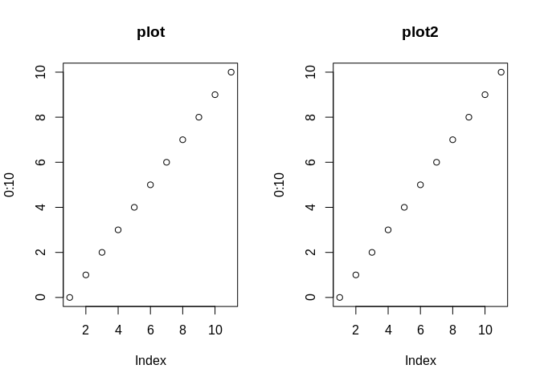

``` r
# restore graphics parameters
par(op)  

# Unlike vanilla plot, however, plot2 allows you to characterize groups 
# (using either the `by` argument or equivalent `|` formula syntax).

aq = transform(
  airquality,
  Month = factor(Month, labels = month.abb[unique(Month)])
)

with(aq, plot2(Day, Temp, by = Month)) ## atomic method
plot2(Temp ~ Day | Month, data = aq)   ## formula method
```

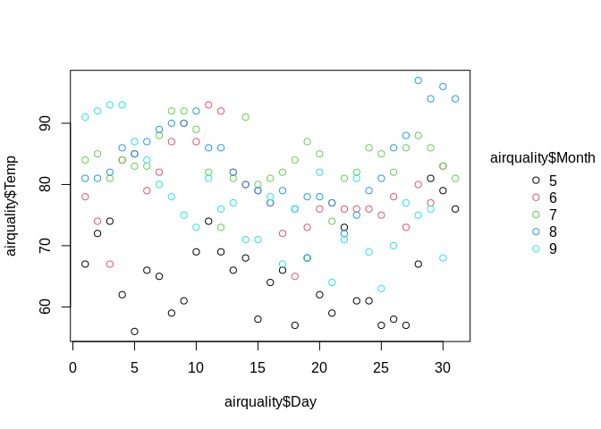

``` r
# Notice that we also get an automatic legend.

# Use standard base plotting arguments to adjust features of your plot.
# For example, change `pch` (plot character) to get filled points.

plot2(
  Temp ~ Day | Month,
  data = aq,
  pch = 16
)
```

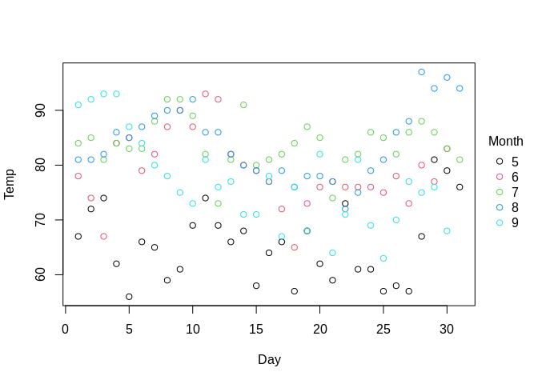

``` r
# Converting to a grouped line plot is a simple matter of adjusting the
# `type` argument.

plot2(
  Temp ~ Day | Month,
  data = aq,
  type = "l"
)
```

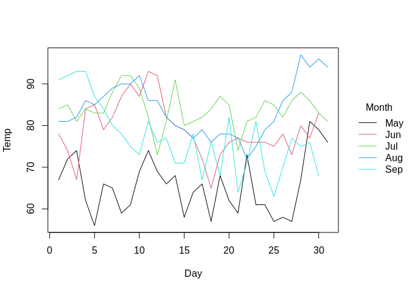

``` r
# Similarly for other plot types, including some additional ones provided
# directly by plot2, e.g. density plots or internal plots (ribbons, 
# pointranges, etc.)

plot2(
  ~ Temp | Month,
  data = aq,
  type = "density",
  fill = "by"
)
```

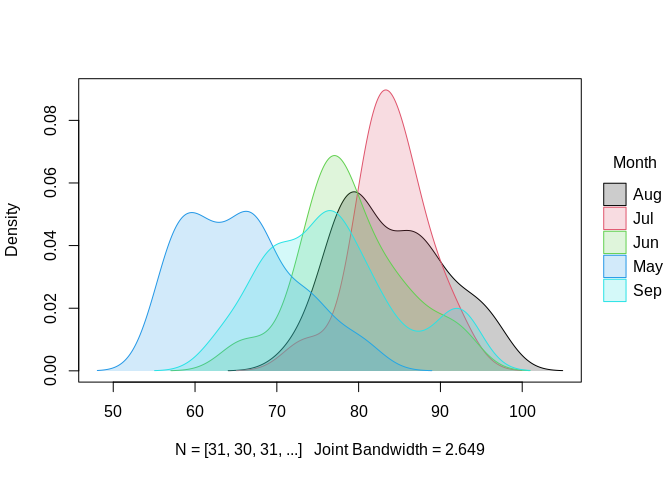

``` r
# Facet plots are supported too. Facets can be drawn on their own...

plot2(
  Temp ~ Day,
  facet = ~ Month, 
  data = aq,
  type = "area",
  main = "Temperatures by month"
)
```

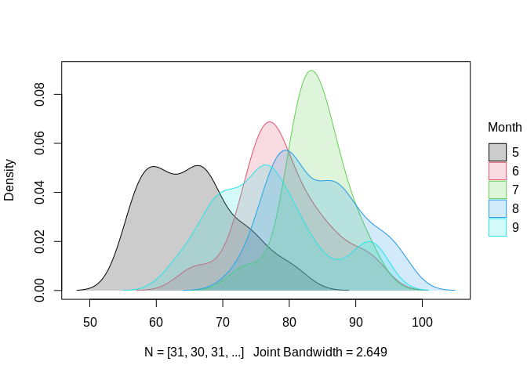

``` r
# ... or combined/contrasted with the by (colour) grouping.

aq = transform(aq, Summer = Month %in% c("Jun", "Jul", "Aug"))
plot2(
  Temp ~ Day | Summer,
  facet = ~ Month, 
  data = aq,
  type = "area",
  palette = "dark2",
  main = "Temperatures by month and season"
)
```

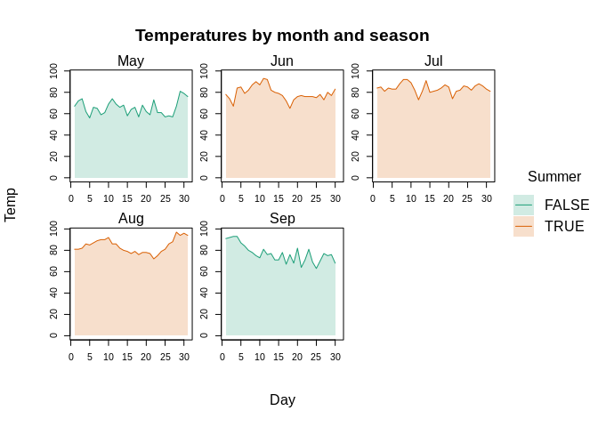

``` r
# Users can override the default square window arrangement by passing `nrow`
# or `ncol` to the helper facet.args argument. Note that we can also reduce
# axis label repetition across facets by turning the plot frame off.

plot2(
  Temp ~ Day | Summer,
  facet = ~ Month, facet.args = list(nrow = 1),
  data = aq,
  type = "area",
  palette = "dark2",
  frame = FALSE,
  main = "Temperatures by month and season"
)
```

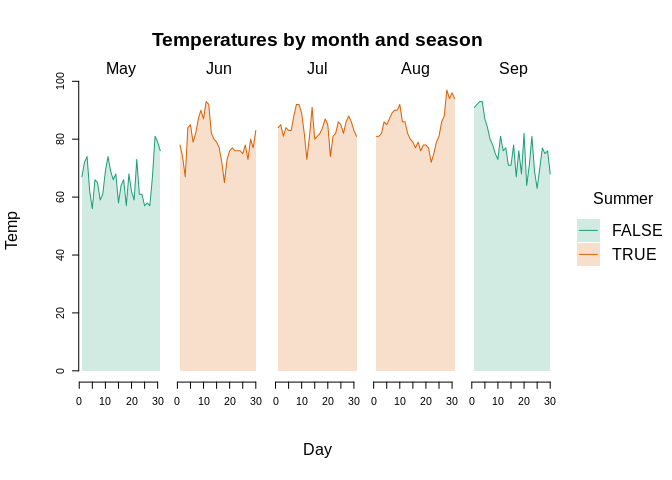

``` r
# Use a two-sided formula to arrange the facet windows in a fixed grid.
# LHS -> facet rows; RHS -> facet columns

aq$hot = ifelse(aq$Temp>=75, "hot", "cold")
aq$windy = ifelse(aq$Wind>=15, "windy", "calm")
plot2(
 Temp ~ Day,
 facet = windy ~ hot,
 data = aq
)
```

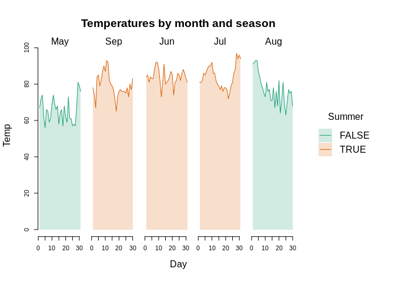

``` r
# The (automatic) legend position and look can be customized using
# appropriate arguments. Note the trailing "!" in the `legend` position
# argument below. This tells `plot2` to place the legend _outside_ the plot
# area.

plot2(
  Temp ~ Day | Month,
  data = aq,
  type = "l",
  legend = legend("bottom!", title = "Month of the year", bty = "o")
)
```

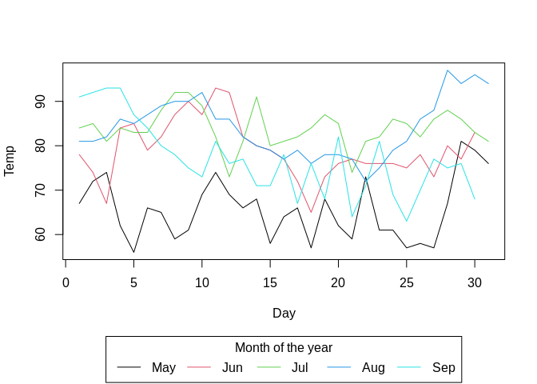

``` r
# The default group colours are inherited from either the "R4" or "Viridis"
# palettes, depending on the number of groups. However, all palettes listed
# by `palette.pals()` and `hcl.pals()` are supported as convenience strings,
# or users can supply a valid palette-generating function for finer control
# over transparency etc.

plot2(
  Temp ~ Day | Month,
  data = aq,
  type = "l",
  palette = "tableau"
)
```

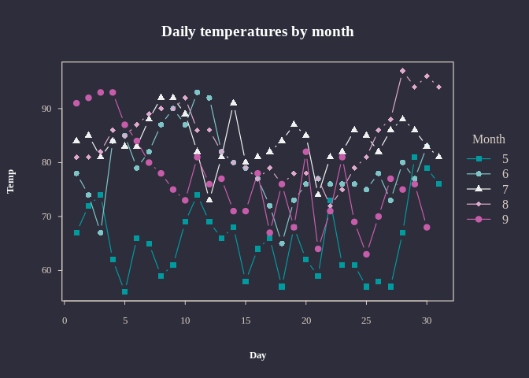

``` r
# It's possible to further customize the look of you plots using familiar
# arguments and base plotting theme settings (e.g., via `par`).

par(family = "HersheySans", las = 1)
plot2(
  Temp ~ Day | Month,
  data = aq,
  type = "b", pch = 16,
  palette = palette.colors(palette = "tableau", alpha = 0.5),
  main = "Daily temperatures by month",
  frame = FALSE, grid = TRUE
)
```

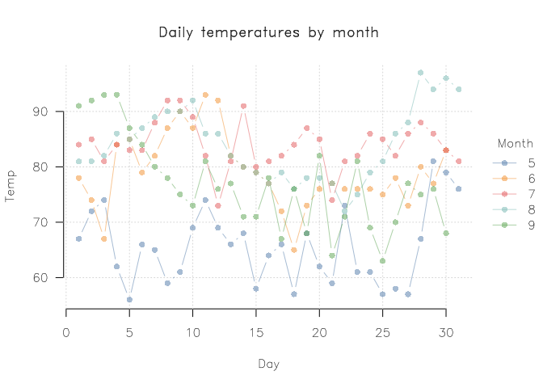

``` r
par(family = "") # revert global font change from above
```
